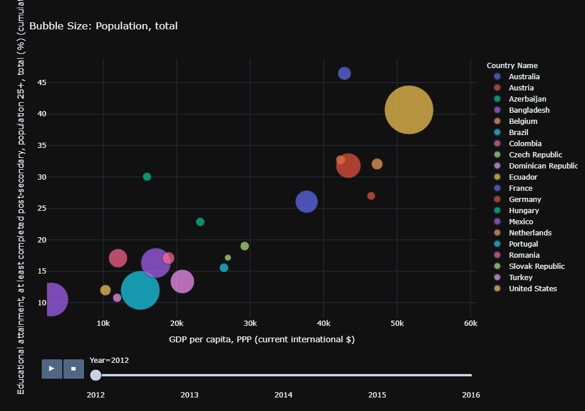
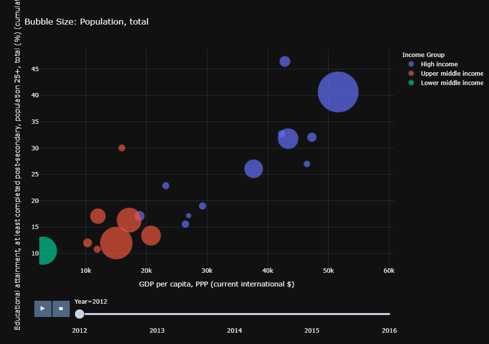
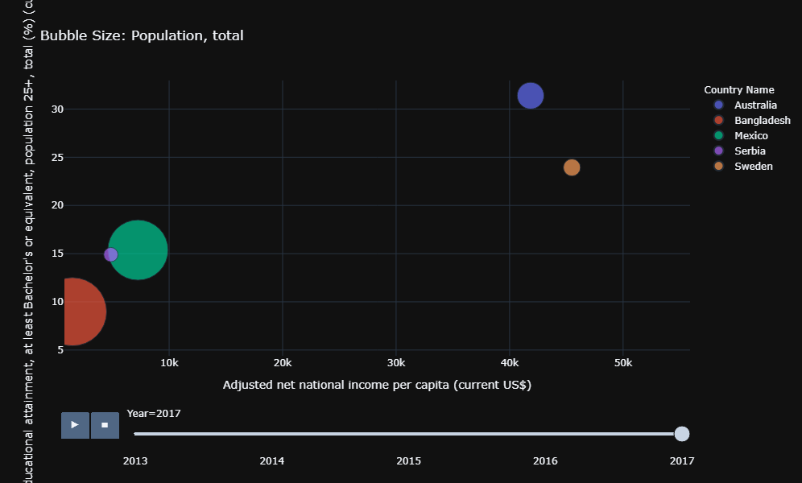
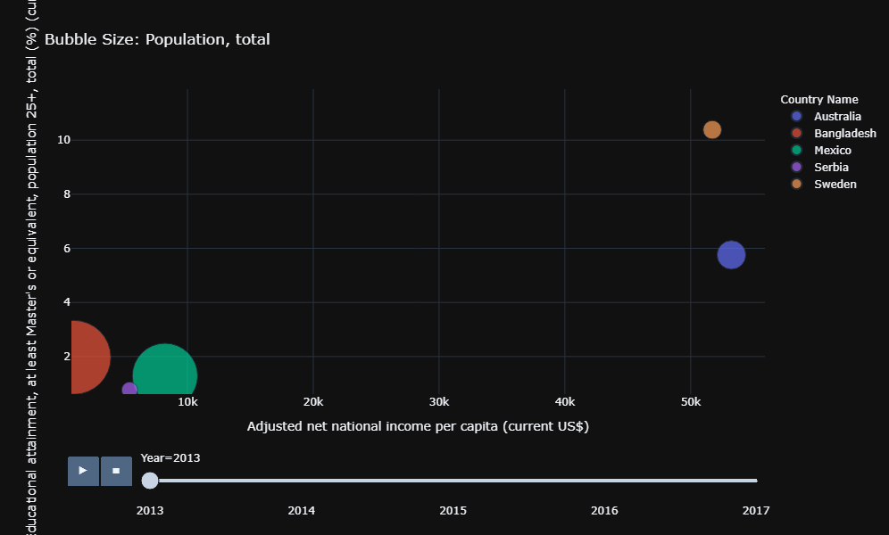
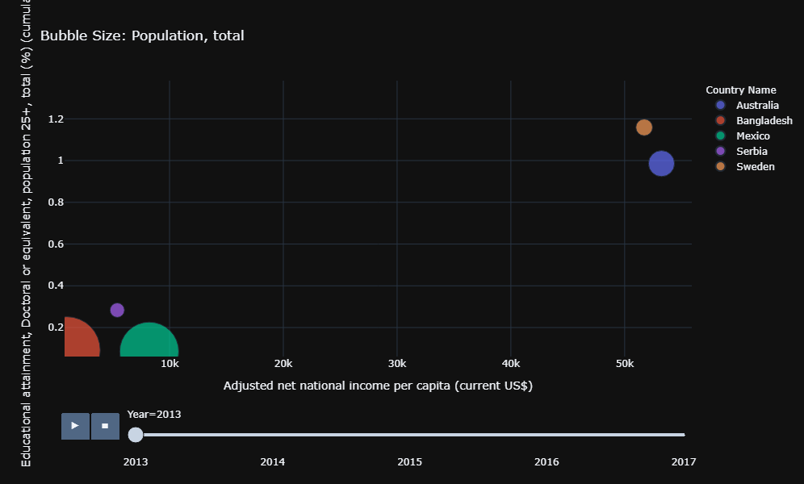
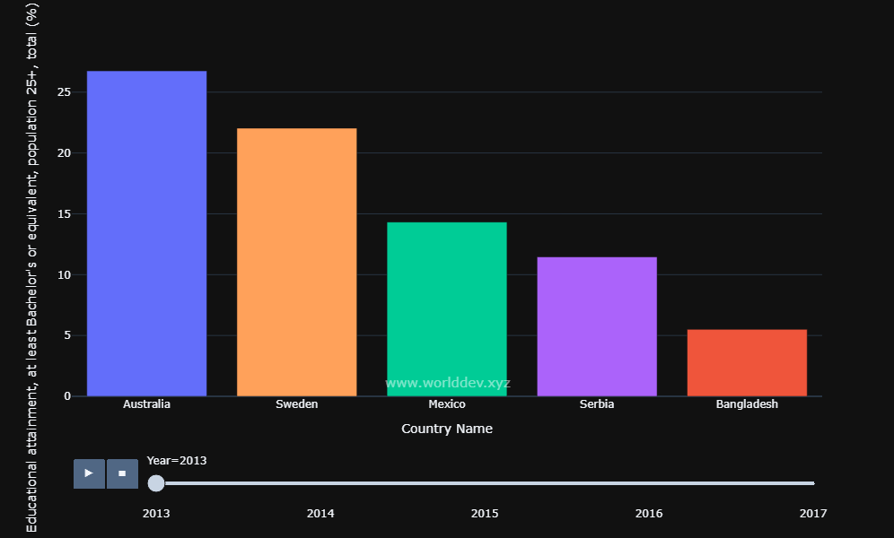
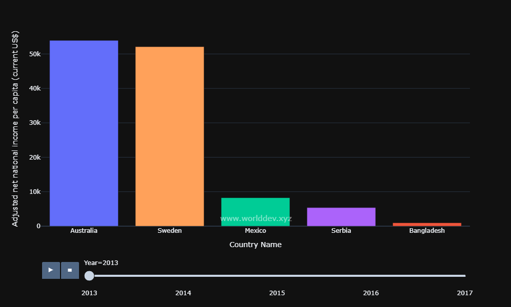
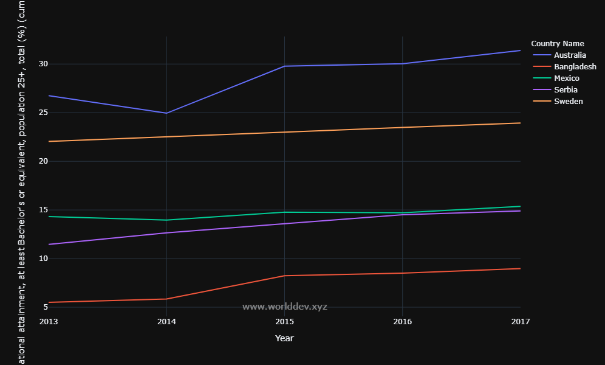

#  Does 👩‍🏫 + 📚 + 🕓 + 🎓 === 💵💵💵💵?
  
Something that is emblematic of the immigrant experience is the focus on hard work, resilience, and educational attainment. And, although I was born in this country, I, also come from a long line of immigrants. So I know what it’s like to live the immigrant experience. When I was a kid, it sometimes felt like education was the end all be all of belonging to an immigrant family. There was such intense focus on it from everyone in my family — my parents and aunts and uncles and grandparents and even friends of the family. They all waxed eloquent about the virtues of education. They were relentless (or, at least, it felt that way). Basically, it was the only thing I ever heard about, ever. Education represented a way for a person to change their lot in life — to have a chance at achieving financial security or maybe even gaining real wealth. In short, education was the key to success. It wasn’t just education writ ?large that was the focus — it was post-secondary education that was lauded as the ultimate goal. 
 
Growing up in this environment, naturally meant I learned from an early age to value and appreciate the pursuit of higher education. However, since I was little, I never took anything I was told on faith alone. Because of this, I felt inclined to research whether there really was any correlation between between higher education and wealth, or was it all part of my immigrant mythology. In order to answer this question, I pointed my web browser to http://www.worlddev.xyz/. This website is a treasure trove of information. It aggregates open-source data collected from the World Bank and presents the data visually in the form of charts and graphs. It is an excellent tool to probe for answers to my question. 
 
I agonized for weeks on what specific questions I could ask. There is so much data on worlddev.xyz to comb through. I felt overwhelmed. While feverishly scouring over the data I stumbled upon three indicators that piqued my interest. They involved the different levels of post-secondary education. That is, the attainment of bachelor’s, master’s, and doctoral degrees. I thought to myself, “this is it!”. It was something that spoke to me and my experience. It was exactly what I was looking for. 
 
I want to examine these data to see if there is a relationship between a country’s wealth and the proportion of its population that has obtained higher education. I am curious to know what these two factors can tell us about larger global trends. 
 
The world bank describes the bachelor’s degree attainment as, “The percentage of population ages 25 and over that attained or completed Bachelor's or equivalent,” (databank.worldbank.org). The wording is exactly the same for the other two degrees as well. It stands to reason that since a subordinate degree is a prerequisite for getting a higher degree then it is understood that the bachelor’s indicator will include some number of persons with master’s and doctoral degrees. And that the master’s indicator will include some portion of people that have also received doctoral degrees. This fact aside I think it is still worthwhile to see what impressions we can glean regarding all three indicators. 
 
They will be compared against economic indicators: GDP per capita (Current US$) and Adjusted Net National Income (Current US$). The definitions of each are as described by the world bank’s website are provided below.
 
**GDP per capita (Current US$)**`
 
>“GDP per capita is gross domestic product divided by midyear population. GDP is the sum of gross value added by all resident producers in the economy plus any product taxes and minus any subsidies not included in the value of the products. It is calculated without making deductions for depreciation of fabricated assets or for depletion and degradation of natural resources. Data are in current U.S. dollars.”
        
**Adjusted Net National Income (Current US$)**
 
>“Adjusted net national income is GNI minus consumption of fixed capital and natural resources depletion.”
 
I chose GDP because it is the indicator I see used most often in the world of economics and politics. It is the “gold standard” of economic indicators. As the definition states it reflects the entire wealth represented by a given country. However, the numbers stated in terms of GDP are hard for me to wrap my head around. Especially because I am a layperson. I like the net national income indicator because it makes a little more sense to me because it represents on a per capita basis the take-home pay of a person in a given country year-over-year.
 
## Analysis
 
I chose to analyze five countries (Australia, Bangladesh, Mexico, Serbia, Sweden) that had data across five years (2013-2017). I could only pick these five due to the limitations of the dataset. Luckily, the world bank has a similar indicator that compares to the ones I outlined above. 
This indicator also looks at those over 25 and if they have completed post-secondary education. This indicator is not as specific as the ones I'm interested in but can give us a good sense of the overall trends in this space.
 
 
### Select countries percent of population over age 25 with post-secondary education
Here you can see 20 countries represented in the bubble graph below. They are compared against GDP. There is a distinct upward trend reflected in the data. When looking at the next graph. The disparity becomes starker because instead of isolating each data point as an individual country the data are grouped together by income. The high income groups, for the most part, all have the highest rates of post-secondary reducation completion.

 
 
 
### What about Bachelor's, Master's, and Doctoral Degree attainment?
 
I think the post-secondary data gives us a good sense of the validity of the trends even though we are limited to 5 countries' data. Below we can see that for each type of degree the trend is upheld. For each degree type, the wealthiest countries (Australia and Sweden) outstrip the other countries in terms of how many of their citizens have completed higher education.

 

 
 

 
### Two data walk into a bar....
 
Now seeing that there is an established trend that wealth and educational attainment certainly are strongly correlated we can dive deeper. I want to take a closer look at Bachelor's degree attainment. 
 
The bar graphs reiterate the findings established above. But they make the contrast clearer than ever. The bar graphs show a substantial difference between the leaders and the laggards. But that distinction almost jumps out of the screen when looking at the second bar graph. Here we see how much factors like education contribute to a nation's wealth and the wealth of its citizens.

 
### The end of the line
 
Last but not least is a graph looking at bachelor's attainment across these five countries over time. As suspected there are some fluctuations here and there but largely there is an upward trend as we march ever forward in time. Perhaps the most interesting thing of note is that each of the five countries (barring large anomalies) have lines that have the same slope. I'm not sure what that means but it could have to do with a population grown and their university systems have not met their respective capacities. 

 
### This is the end my friend
 
In conclusion, I think that we learned there is a correlation between wealth and educational attainment. But I don’t think there is enough to go on to say that it is the factor that determines whether a country is wealthy or not.
 
What can poorer nations do to improve the education of their citizens? I think that access to food and running water and reliable access to electricity are table stakes. They are critical things that allow a country to become stable. Only then can children be reliably educated and only after completing primary and secondary education they can go on to attempt post-secondary degree attainment. Being highly educated ultimately is a luxury. Even though being educated can lead to even more wealth. The gap between the rich and the poor will only grow bigger if the ‘little guys’ can’t ever catch up.